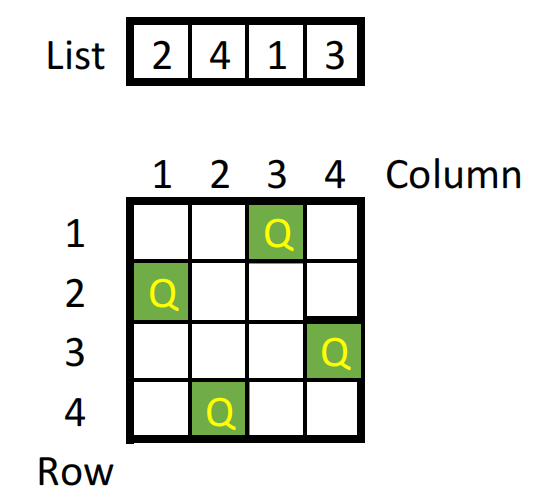
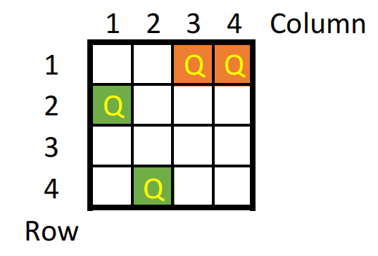
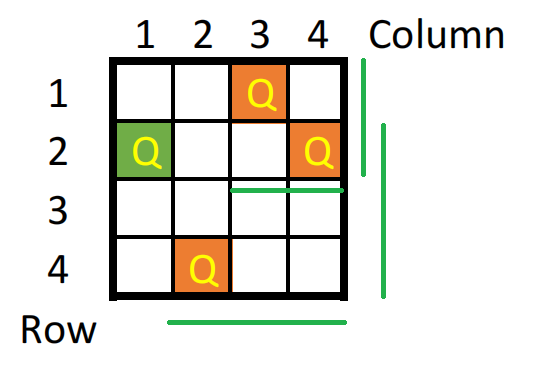

# CO3061_Introduction_to_AI_Assignment: N-queens problem
## Target
- Implement basic Search algorithms
- Solve the N-queens problem
## Introduce
The N-queens problem is a problem that requires placing N queens on an NxN chessboard so that there are no pairs of queens which threatens each other (queen threatens according to chess rules)
## Implementation
### Caution
- In this assignment, we will use Python 3 to solve N-queens problem, so make sure that, you have aldready install these library: 
  + ```random```: generate random number
  + ```numpy```: generate states and better for search
- Each approach is a separated Python ```class```
- We maintain a list of states that have been traversed during the search process ```self.visited```
### Depth Fist Search (DFS) approach
- State-space: All possible arrangements of a queens (0 < a < n), one per column in the leftmost a columns, with no queen attacking another.
- Actions: Add a queen to any square in the leftmost empty column such that it is not attacked by any other queen.
- Algorithms:
  1. Evaluate the initial state: No queen has been place on the chessboard. Then put initial state on the top of a stack
  2. Take the state on the top of the stack and add to visited list. If that state is the solution then end algorithm
  3. Create a list of successor states of that state by applying legal action. Add all of them on the top of the stack
  4. Repeat (2.) and (3.) until the stack is empty or there are no more actions that can be applied
- Implementation (using Python):
  1. Initial function:
    + The number of queen: ```self.n```
    + A state is represent by a ```list```:
       * Each element in the list represent a column;
       * The order of column equals the index of corresponding elemnt plus 1;
       * The value of element is the row that the queen will be placed on the chessboard; 
       * The lenght of list (```len(<list>)```) represent the number of queens that have been placed on the chessboard; 
        <p align="center">
          
          
        </p>
    + Initial state: empty list ```self.initstate = []```
  2. Action (Move) function: Add a queen to any square in the leftmost empty column such that it is not attacked by any other queen
    + Parameter:
        * ```curr_state```: current state
        * ```x```: the position of square in the leftmost empty column that the queen is added to
    + Process:
        * Generate new state: ```new_state = curr_state + [x]```
        * If the curent state has no queen on chessboard (initial state) then the action add new queen is alway legal, return ```new_state```
        * Otherwise, check whether the new added queen is attacking old queens or not. If conflict occurs then the action is illegal, else legal: Two queens attack eachother when they have the same row index or satisfies condition ```abs(row_index_queen1 - row_index_queen2) == abs(column_index_queen1 - column_index_queen2)```
        <p align="center">
          
          
        </p>
    + Return value:
        * Empty list ```[]``` if action is not legal
        * New state if action is legal
  3. Solve function:
    + Evaluate initial state: ```self.initstate = []``` and a stack  ```stack = [self.initstate]```
    + Loop until the stack is empty ```len(stack) == 0```
      * Take the state on top of the stack as current state. If curent state is the solution - the length of current state equals the max number of queens ```len(curr_state)==self.n``` - then ```return curr_state```
      * Generate all possible succesors states of current state by applying ```add_queen()``` then push to the stack
    + Print out no solution found and return empty list ```[]```
### Breath Fít Search (BrFS) approach
- State-space: All possible arrangements of a queens (0 < a < n), one per column in the leftmost a columns, with no queen attacking another.
- Actions: Add a queen to any square in the leftmost empty column such that it is not attacked by any other queen.
- Algorithms
- Implementation (using Python):
  1. State:
  2. How to know if two queens attacking eachother?
### Heuristic approach
- State-space
