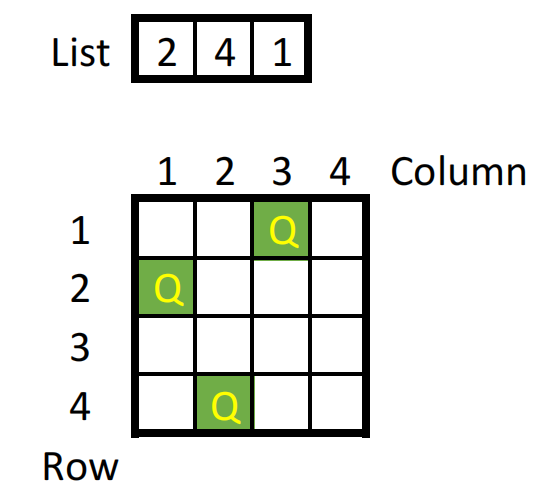

# CO3061_Introduction_to_AI_Assignment: N-queens problem
## Target
- Implement basic Search algorithms
- Solve the N-queens problem
## Introduce
The N-queens problem is a problem that requires placing N queens on an NxN chessboard so that there are no pairs of queens which threatens each other (queen threatens according to chess rules)
## Implementation
### Caution
- In this assignment, we will use Python 3 to solve N-queens problem, so make sure that, you have aldready install these library: 
  + ```random```: generate random number
  + ```numpy```: generate states and better for search
- Each approach is a separated Python ```class```
- We maintain a list of states that have been traversed during the search process ```self.visited```
### Depth Fist Search (DFS) approach
- State-space: All possible arrangements of a queens (0 < a < n), one per column in the leftmost a columns, with no queen attacking another.
- Actions: Add a queen to any square in the leftmost empty column such that it is not attacked by any other queen.
- Algorithms:
  1. Evaluate the initial state: No queen has been place on the chessboard. Then put initial state on the top of a stack
  2. Take the state on the top of the stack and add to visited list
  3. Create a list of successor state of that state by applying legal action. Add all of them on the top of the stack
  4. Repeat (2.) and (3.) until the stack is empty or there are no more actions that can be applied 
- Implementation (using Python):
  1. Initial function:
     
     
     
    + The number of queen: ```self.n```
    + A state is represent by a ```list```:
       * Each element in the list represent a column;
       * The order of column equals the index of corresponding elemnt plus 1;
       * The value of element is the row that the queen will be placed on the chessboard; 
       * The lenght of list (```len(<list>)```) represent the number of queens that have been placed on the chessboard; the order of a column equals sum of the index
        
    + Initial state: empty list ```self.initstate = []```
  3. Take the state on the top of the stack and add to visited list
### Breath Fít Search (BrFS) approach
- State-space: All possible arrangements of a queens (0 < a < n), one per column in the leftmost a columns, with no queen attacking another.
- Actions: Add a queen to any square in the leftmost empty column such that it is not attacked by any other queen.
- Algorithms
- Implementation (using Python):
  1. State:
  2. How to know if two queens attacking eachother?
### Heuristic approach
- State-space
